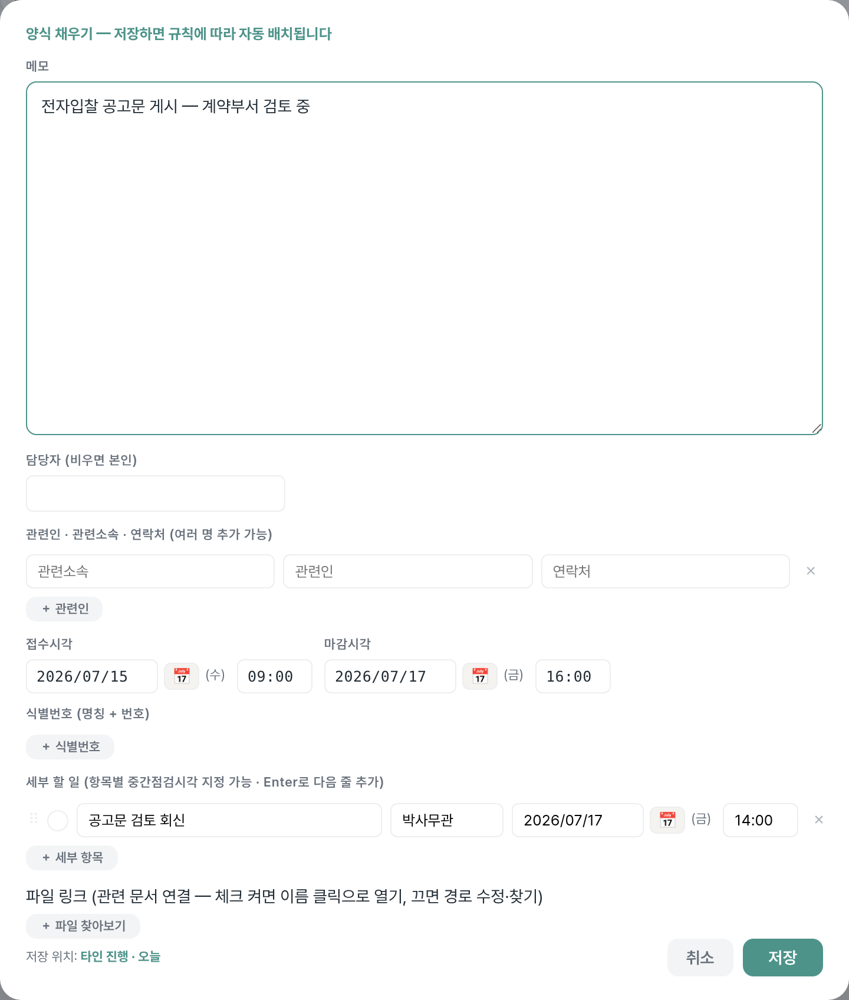
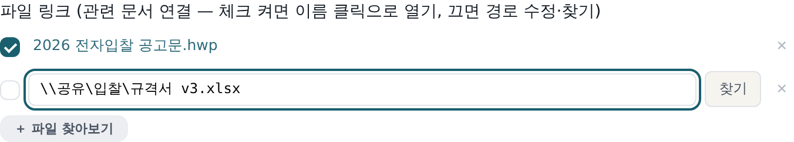
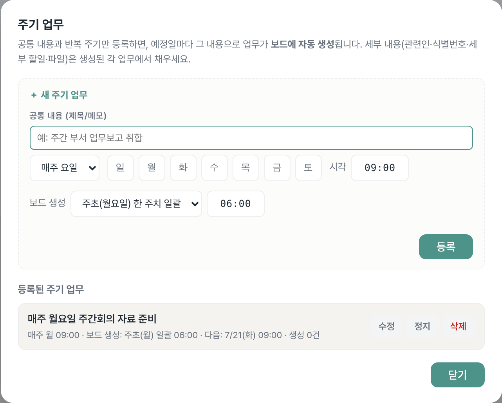
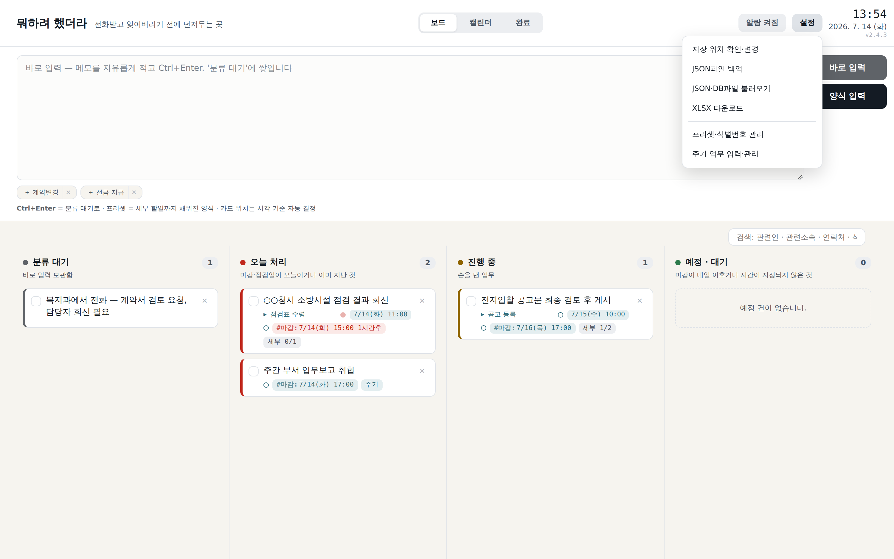
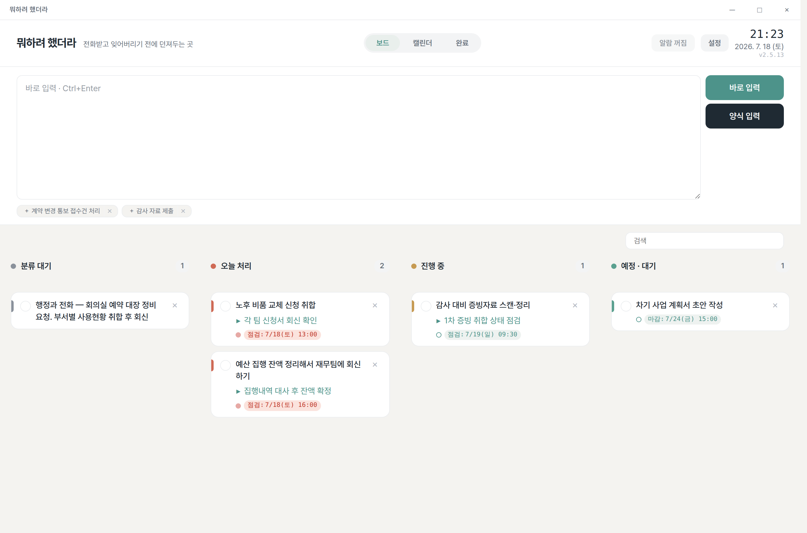
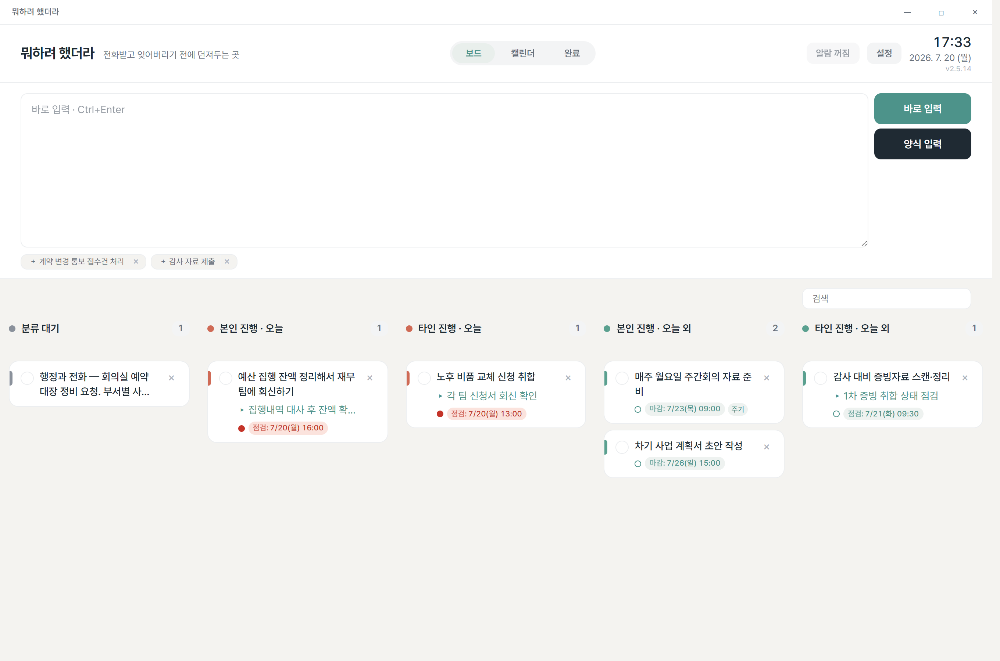
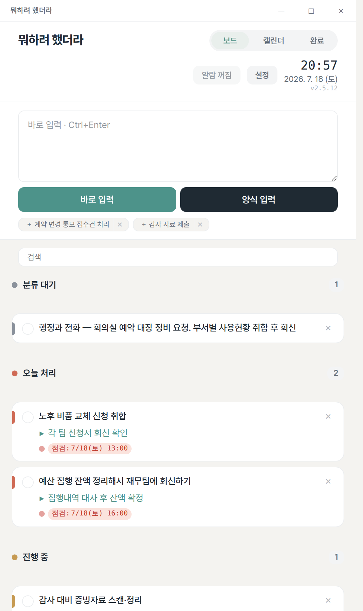
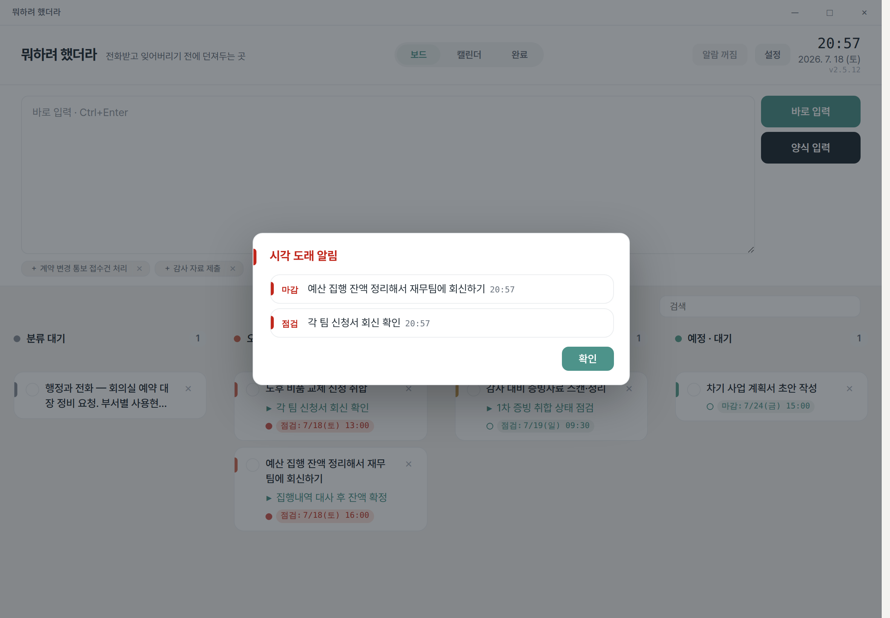
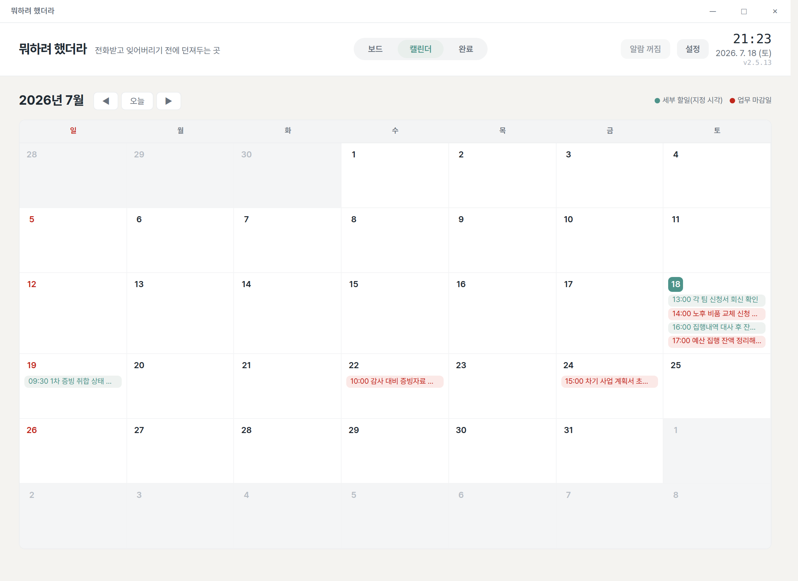

# 뭐하려 했더라 — 사용 설명서

> 전화를 받다가, 회의를 하다가 "아 이거 해야 하는데" 싶은 일 —
> **일단 던져만 두면 잊지 않게 챙겨 주는** 개인 업무 보드입니다.
> 인터넷도, 설치도, 계정도 필요 없어요.

**이 앱을 한마디로 —** 할 일을 칸에 일일이 정리하는 게 아니라, **시각(마감·점검 때)만 적어 두면
프로그램이 "오늘 할 일"을 알아서 골라 위로 올려 줍니다.** 그래서 손이 훨씬 덜 갑니다.

---

## 목차

1. [30초 요약](#1-30초-요약)
2. [처음 실행하기](#2-처음-실행하기)
3. [딱 하나만 기억하세요 — 카드는 손으로 옮기지 않습니다](#3-딱-하나만-기억하세요--카드는-손으로-옮기지-않습니다)
4. [일 던져두기 (입력하는 3가지 방법)](#4-일-던져두기-입력하는-3가지-방법)
5. [보드 자세히 보기](#5-보드-자세히-보기)
6. [알람 — 때가 되면 알려줍니다](#6-알람--때가-되면-알려줍니다)
7. [끝난 일 · 검색 · 달력](#7-끝난-일--검색--달력)
8. [창을 닫아도 꺼지지 않습니다](#8-창을-닫아도-꺼지지-않습니다)
9. [내 데이터는 안전한가요?](#9-내-데이터는-안전한가요)
10. [자주 묻는 질문](#10-자주-묻는-질문)

---

## 1. 30초 요약

익숙해지는 데 딱 네 단계면 됩니다.

1. **던진다** — 떠오른 일을 적고 `Ctrl+Enter`. 다른 프로그램을 쓰는 중이면 `Ctrl+Alt+Space`.
2. **정리한다** — 짬이 날 때 '분류 대기'에 쌓인 카드를 눌러 마감 시각·세부 할 일을 채웁니다.
3. **맡긴다** — 카드는 손으로 옮기지 않습니다. 시각을 보고 프로그램이 알맞은 칸에 놓아 줍니다.
4. **챙김을 받는다** — 시각이 되면 알림창이 앞으로 튀어나옵니다. 끝낸 일은 체크 → [완료]로.

가장 자주 쓰는 키:

| 키 | 하는 일 |
|---|---|
| `Ctrl+Enter` | 메모 등록 (메인 입력창·빠른 메모창 공통) |
| `Ctrl+Alt+Space` | 어디서든 빠른 메모창 열기 (고정 단축키) |
| `Alt` | (빠른 메모창에서) 메모 쓰기 ↔ 내 업무 검색 전환 |
| `Esc` | 창 닫기 — 쓰던 내용은 지워지지 않음 |

---

## 2. 처음 실행하기

1. `뭐하려 했더라.exe` 파일을 아무 곳(바탕화면, D드라이브 등)에 복사합니다.
2. 더블클릭하면 끝입니다. **설치도, 관리자 권한도 필요 없어요.**
3. 첫 실행 때 "데이터를 어디에 보관할까요?" 하고 폴더를 물어봅니다.
   - 폴더를 고르면 그 안에 `뭐하려했더라_데이터` 폴더가 생기고, 데이터와 자동 백업이 **전부 거기에만** 저장됩니다.
   - 그냥 건너뛰어도 됩니다 — 나중에 [설정] → **[저장 위치 확인·변경]** 에서 언제든 옮길 수 있어요.

> 이미 켜져 있는데 또 실행하면, 새 창이 뜨는 대신 기존 창이 앞으로 나옵니다.

---

## 3. 딱 하나만 기억하세요 — 카드는 손으로 옮기지 않습니다

이 앱이 다른 할 일 앱과 가장 다른 점입니다. **카드를 이 칸 저 칸으로 끌어다 놓지 않아요.**

대신 카드에 **마감 시각**이나 **세부 할 일의 점검 시각**만 적어 두면,
프로그램이 그 시각을 보고 "오늘 할 일인지, 나중 일인지"를 판단해 알맞은 칸에 넣습니다.
같은 칸 안에서는 **시각이 가장 먼저 다가오는 일이 맨 위**로 올라오니, **위에서부터 처리**하면 됩니다.

그래서 사용하는 요령은 간단합니다 — **자리를 고민하지 말고, 시각만 정확히 넣으세요.**
"오늘 뭘 먼저 해야 하지?"는 프로그램이 정리해 줍니다.

> 특정 카드를 다른 칸으로 옮기고 싶다면, 카드를 눌러 **마감·점검 시각을 바꾸면** 자연스럽게 자리가 바뀝니다.

---

## 4. 일 던져두기 (입력하는 3가지 방법)

상황에 따라 골라 쓰세요. **급할수록 위쪽 방법**이 빠릅니다.

### ① 바로 입력 — 가장 빠름
화면 위 입력창에 적고 `Ctrl+Enter` (또는 [바로 입력] 버튼)를 누르면 '분류 대기'에 쌓입니다.
전화를 받는 중이라면 일단 이걸로 던져두세요. 내용이 길어지면 입력창이 **자동으로 늘어납니다**(등록하면 원래 높이로 돌아옴).

### ② 빠른 메모창 — 다른 프로그램을 쓰는 중일 때
문서·결재 화면을 보다가도 `Ctrl+Alt+Space` 를 누르면 작은 메모창이 뜹니다. 적고 `Ctrl+Enter` — 끝. '분류 대기'로 들어갑니다.

안심하고 써도 되는 이유:
- `Esc` 를 누르거나 다른 창으로 넘어가 닫혀도 **쓰던 내용은 남습니다.** 지워지는 건 직접 지울 때뿐이에요.
- 쓰다 만 채로 컴퓨터가 꺼져도, **다음 실행 때 '분류 대기'에 자동으로 등록**됩니다.
- `Alt` 를 누르면 **내 업무 검색**으로 바뀝니다. 결과마다 진행/완료 표시가 붙고, 클릭하면 메인 창에서 열려요. `Alt` 를 다시 누르면 메모로 돌아옵니다(내용 그대로).

### ③ 양식 입력 — 제대로 정리할 때
[양식 입력] 버튼을 누르거나 카드를 클릭하면 자세한 양식이 열립니다.

| 항목 | 적는 것 |
|---|---|
| **메모** | 무슨 일인지 |
| **관련소속 · 관련인 · 연락처** | 누가 요청했는지 (여러 명 가능) |
| **접수 · 마감시각** | 받은 때와 최종 기한 |
| **식별정보** | 입찰공고번호, SR번호 같은 번호들 |
| **세부 할 일** | 중간 단계들 — 단계마다 점검 시각·**담당자**(비우면 본인) 지정 가능 |
| **파일 링크** | 관련 문서(한글·엑셀 등) 연결 |

- **파일 링크**는 행마다 켜고 끌 수 있어요. **켜면** 파일 이름이 링크가 되어 클릭 즉시 열리고(수정 잠금), **끄면** 경로를 직접 고치거나 [찾기]로 파일을 다시 고를 수 있습니다.

  

- 세부 할 일·관련인·프리셋·식별정보는 왼쪽 ⠿ 손잡이를 잡고 **드래그로 순서를 바꿀** 수 있습니다.

### 반복되는 일은 한 번만 — 주기 업무
매주 보고, 매월 점검처럼 되풀이되는 일은 **[설정] → 주기 업무 입력·관리**에서 한 번만 등록해 두세요.

1. 공통 내용(제목·메모)과 반복 주기를 정합니다 — `매주 요일`(월·수 등) 또는 `매월 며칠`(그 달에 없는 날짜는 말일로 보정) + 시각.
2. **보드 생성 시점**을 고릅니다 — 카드가 언제 보드에 나타날지예요: `주초(월요일) 한 주치 일괄`(그 주 할 일이 월요일 아침에 한꺼번에 — 기본값) · `하루 전` · `당일` 중에서. 옆의 시각(기본 06:00)은 그 카드가 만들어지는 기준 시각입니다.
3. 정한 시점이 되면 할 일이 **보드에 자동으로 생깁니다.** 생긴 일은 보통 일과 똑같이 다루면 되고, 카드에는 `주기` 배지가 붙습니다.
4. 등록해 둔 주기는 같은 화면에서 수정·일시정지·삭제할 수 있고, 다음 예정일도 볼 수 있어요.

> 주기 자체는 보드에 카드로 보이지 않습니다. 실제 할 일만 그때그때 생겨나고, 주기를 지워도 이미 생긴 일은 남습니다.

### 자주 하는 일은 틀로 저장 — 프리셋
"○○ 검토 요청"처럼 형태가 반복되는 일은 프리셋으로 저장하세요. 버튼 한 번에 세부 할 일까지 채워진 양식이 열립니다.
관리는 **[설정] → 프리셋·식별정보 관리**에서.

---

## 5. 보드 자세히 보기

메인 화면이 곧 보드입니다. 카드가 시각에 따라 칸에 정리돼 있어요.

> 예시 데이터로 채운 화면입니다.

### 카드 읽는 법
카드 한 장은 **최대 네 줄**입니다 — 메모만 두 줄까지, 나머지는 각 한 줄(길면 …로 줄임).

| 줄 | 내용 |
|---|---|
| 1~2줄 | **메모** — 무슨 일인지 (최대 두 줄) |
| 3줄 | **세부 할 일** — 다음에 할 중간 단계 (있을 때만) |
| 4줄 | **시각** — `점검:`(다가오는 세부 할 일 시각) 또는 `마감:`(마감 시각) |

- 세부 할 일 줄과 시각 줄은 앞 표시(▸·알람 점)의 시작선을 맞춰 **같은 위치에서 들여쓰기**됩니다.
- 시각 태그는 **임박(지났거나 2시간 이내)일 때만 붉게** 강조됩니다. 그 밖엔 중립색이에요.
- `주기` 배지는 주기 업무에서 자동으로 생긴 카드라는 뜻입니다.
- 시각 앞의 작은 점(●)은 알람 상태예요 → [6. 알람](#6-알람--때가-되면-알려줍니다) 참고.
- 관련인·진행 상황·담당자·파일 같은 자세한 내용은 **카드를 클릭**해 양식에서 봅니다.

### 두 가지 보기 방식
보기 방식은 **[설정] 메뉴 → 보드 모드 선택**을 누르면 뜨는 작은 팝업에서 '시간' 또는 '시간·담당자'로 고릅니다(고른 방식은 저장돼요).

**① 시간 방식 (기본)** — "언제 할 일인가"로 나눕니다.

| 칸 | 여기에 오는 일 |
|---|---|
| **분류 대기** | 방금 던져둔 메모. 아직 마감을 정하지 않은 일 |
| **오늘 처리** | 오늘이 마감이거나, 오늘 점검할 게 있거나, 이미 지난 일 |
| **진행 중** | 마감은 나중이지만 그 전에 점검할 세부 할 일이 잡혀 있는 일 |
| **예정 · 대기** | 마감이 내일 이후라 아직 여유가 있는 일 |

**② 시간·담당자 방식** — "내 일인가, 남에게 넘겨 기다리는 일인가"까지 함께 봅니다.

| 칸 | 여기에 오는 일 |
|---|---|
| **분류 대기** | 방금 던져둔 메모 (시간 방식과 동일) |
| **본인 진행 · 오늘** | 담당이 나, 오늘 처리할(또는 지난) 일 |
| **타인 진행 · 오늘** | 남에게 넘겨둔 일 중 오늘 챙겨야 하는 일 |
| **본인 진행 · 오늘 외** | 담당이 나, 오늘 처리할 시각이 없는 일(내일 이후·시각 없음) |
| **타인 진행 · 오늘 외** | 남에게 넘겨둔 일 중 오늘 처리할 시각이 없는 일 |

- **담당자는 세부 할 일마다** 적습니다(비워 두면 본인).
- 카드의 본인/타인은 *가장 먼저 다가오는 미완료 세부 할 일의 담당자*로 정해집니다. 담당자를 적은 세부 할 일이 없으면 본인 일이에요.

### 화면 크기는 두 가지 — 전체화면과 컴팩트(560px)
창은 **두 크기**만 씁니다. 타이틀바의 **최대화/복원 버튼(□)** 으로 오갑니다(가장자리를 끌어 임의 크기로 바꾸지는 않아요).

- **전체화면** — 넓은 4·5칸 데스크톱 보드. 기본값입니다.
- **컴팩트(560px)** — 세로로 좁은 **한 칸** 보기. 화면 한쪽에 띄워두고 곁눈질하며 쓰기 좋아요. 좁은 폭에 맞춰 입력칸이 세로로 정돈되므로 내용이 화면 밖으로 넘치지 않습니다.

> 컴팩트에서도 카드 표기(메모 2줄·세부·시각)와 색 구분은 그대로예요.

---

## 6. 알람 — 때가 되면 알려줍니다

마감·점검 시각이 되면 **알림창이 뜨고 소리가 납니다**(앱이 뒤에 가려져 있어도 앞으로 나옵니다).

| 버튼 | 하는 일 |
|---|---|
| **[확인]** | 알람 끄기 — 카드에 확인 표시(초록 점)가 남습니다 |

카드의 작은 점(●)이 알람 상태를 나타냅니다: **빈 점**(대기) → **빨강**(울리는 중) → **초록**(확인함).
끝낸 일에는 점이 없어요. 알람 전체는 상단의 알람 버튼으로 켜고 끕니다.

---

## 7. 끝난 일 · 검색 · 달력

**끝난 일** — 카드 왼쪽 동그라미를 체크하면 [완료] 탭으로 넘어갑니다. 완료 카드는 메모와 `완료: 시각`을 보여줘요.
카드를 ×로 지웠다면, 직후에 뜨는 알림에서 **실행 취소**할 수 있습니다.

**검색** — 검색창에 무엇이든 넣어 보세요: 메모 내용, 관련인, 소속, 담당자, 번호, 파일 이름. 연락처는 `01012345678`처럼 숫자만 쳐도 찾아집니다.

**달력** — 이번 달 일정을 한눈에 봅니다. **진행 중인 일만** 나와요: 그날 마감(빨강)과 그날 점검할 세부 할 일(회청색)만 표시되고, 끝낸 것은 나오지 않습니다. 날짜를 누르면 그날의 일 목록이 아래에 열립니다.

---

## 8. 창을 닫아도 꺼지지 않습니다

창의 ×를 눌러도 프로그램은 **화면 오른쪽 아래 트레이(시계 옆)** 에 남아, 알람과 빠른 메모 단축키를 계속 챙깁니다.

- 트레이 아이콘 **클릭** → 창 다시 열기
- 트레이 아이콘 **우클릭** → 나오는 메뉴에서 [종료] (완전히 끄기)

---

## 9. 내 데이터는 안전한가요?

- **저장은 자동입니다.** 바꾸는 즉시 저장돼요 — 저장 버튼이 아예 없습니다.
- **자동 백업** — 30분마다, 그리고 날마다 첫 백업본을 14일간 보관합니다.
- 시작할 때 데이터 파일이 손상돼 있으면 **가장 최근 백업으로 스스로 복구**합니다.
- 모든 데이터는 **내가 고른 폴더 안에만** 있습니다. 인터넷으로 나가는 것은 하나도 없어요.

**다른 컴퓨터로 옮기기** — [설정] 메뉴에서:

| 버튼 | 용도 |
|---|---|
| **[JSON파일 백업]** | 데이터 전체를 파일 하나로 저장 → 새 PC에서 [불러오기]로 복원 |
| **[JSON·DB파일 불러오기]** | JSON 백업 또는 `.sqlite` 백업을 골라 복원 |
| **[XLSX 다운로드]** | 엑셀로 내보내기 — **보고서용**입니다(복원 불가, 이사·백업은 JSON으로) |

---

## 10. 자주 묻는 질문

**Q. 인터넷이 안 되는 PC인데 쓸 수 있나요?**
네. 인터넷을 전혀 쓰지 않습니다. 내부망·폐쇄망에서 그대로 동작해요.

**Q. 설치 권한이 없는데요?**
설치 과정 자체가 없습니다. exe 파일 하나를 복사해 실행하면 끝이에요.

**Q. 실행이 안 돼요.**
구형 Windows 10이라면 "WebView2 런타임"이 없을 수 있습니다(Windows 11·최신 Windows 10은 기본 내장). 전산 담당자에게 WebView2 오프라인 설치를 요청하세요.

**Q. 알람 소리가 안 나요.**
상단 알람 버튼이 꺼져 있지 않은지, Windows 알림 설정에서 이 앱이 차단되지 않았는지 확인해 보세요.

**Q. 컴퓨터를 바꾸게 됐어요.**
[JSON파일 백업]으로 파일 하나를 만들어 가져간 뒤, 새 PC에서 [JSON·DB파일 불러오기]를 하면 됩니다. exe도 같이 복사하면 끝이에요.

**Q. 창을 특정 크기로 조절하고 싶어요.**
창은 **전체화면**과 **컴팩트(560px)** 두 가지만 지원합니다. 타이틀바의 □ 버튼으로 두 크기를 오가세요.

**Q. 카드를 원하는 칸으로 직접 옮기고 싶어요.**
이 보드는 자리를 손으로 옮기지 않는 게 특징입니다([3번](#3-딱-하나만-기억하세요--카드는-손으로-옮기지-않습니다) 참고). 옮기고 싶다면 카드를 눌러 **마감·점검 시각을 바꾸면** 알맞은 칸으로 이동합니다.
